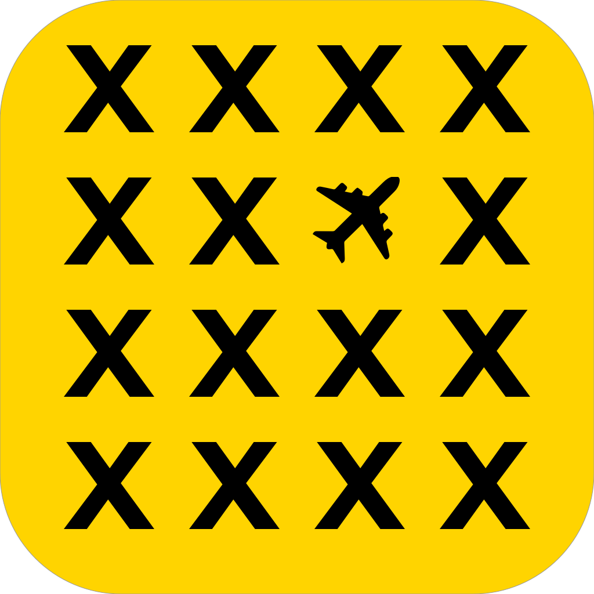

# Where is my API?
Cross-platform game for connecting and entertaining people in airport queues

## Introduction
This project, developed by **Sugus Team** during the HackUPC 2019 hackathon, is called *Where is my API?* after the sentence: *Where is my **A**ir**p**lane **i**n this moment?*.

It consists in a collaborative game that establishes a competition between the different queues in an airport. By using their mobile phones or laptops, queueing people can be entertained while they participate in a game along with the people waiting around them.

## The Game
In the game, players are given some information about a flight (which is currently in transit):
* The departure and arrival airports (laid out in a map)
* The departure time

With this information, the player has to guess the current plane position in the map. Each one of them is graded according to the precision of their guess. The points awarded to each member of a gate queue add up. By adding this aspect, we turn the game into a social experience in which people have to work together in order to win the game.

### The grading system
The points each user is awarded depend on the distance to the actual position of the plane. It is computed according to the formula:
, with m = 1000, a = 3000², b = 10000 (d is the distance between both points computed using the haversine algorithm).

This score is then averaged with all the other members of the queue, and the score of each round is the result of this average operation. This score is then added to total classification.
